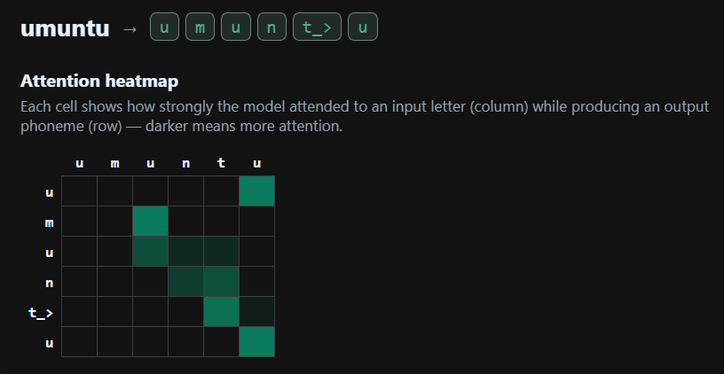
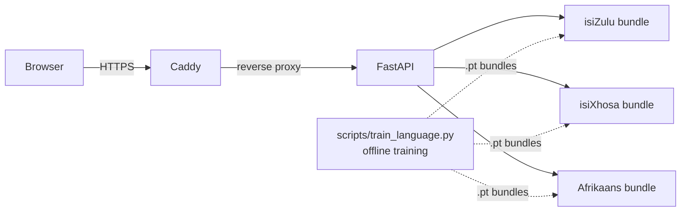

# PhonemeZA — South African grapheme-to-phoneme

PhonemeZA predicts the pronunciation of isiZulu, isiXhosa, and Afrikaans words
from their spelling, using a sequence-to-sequence model whose LSTM cells and
attention are implemented from scratch in PyTorch (no `nn.LSTM`). Type a word
and it returns the phoneme sequence in X-SAMPA plus a heatmap of which input
letters the decoder attended to at each output step.

**▶ Live demo: https://phonemeza.duckdns.org**



## Results

Test-set metrics (held-out 10% split; PER = phone error rate, the mean
edit distance between predicted and reference phoneme sequences normalised by
reference length):

| Language | Context | PER | Word accuracy |
|----------|---------|----:|--------------:|
| isiZulu  | attention | 0.0031 | 98.7% |
| isiXhosa | attention | 0.0017 | 99.0% |
| Afrikaans | attention | 0.0284 | 82.4% |
| Afrikaans | bottleneck (no attention) | 0.0894 | 69.6% |

The Nguni languages (isiZulu, isiXhosa) score near-perfect, but that number
deserves caveats. Their orthographies are close to phonemic, the NCHLT
Southern-Bantu dictionaries are largely rule-derived, and the languages are
agglutinative — so stems and affixes recur across the train/test boundary even
though the word lists are disjoint. Afrikaans, whose pronunciations are less
predictable from spelling, is the truer test, and there the attention decoder
cuts PER roughly 3× and raises word accuracy from 69.6% to 82.4% over a
bottleneck decoder that must compress the whole word into one fixed vector.
That replicates the classic attention-vs-bottleneck finding from the original
CMUdict experiments on a new set of languages.

## Architecture

- **From-scratch recurrence.** `LSTMCell` and an attention-augmented
  `LSTMCellWithContext` are written out gate-by-gate (`g2p/model.py`); the
  encoder and decoder stack these manually rather than calling `nn.LSTM`.
- **Dot-product attention.** At each decoding step the decoder scores its
  hidden state against every encoder state, masks padding, and forms a context
  vector that feeds the gates. Those weights are exactly what the UI heatmap
  visualises.
- **Greedy decoding** at inference, emitting phonemes until `<EOS>`.
- **X-SAMPA vocabulary.** Phones are atomic tokens, so isiXhosa click
  consonants and other multi-character symbols (e.g. `|\`, `!\`, `kh`) are
  single vocabulary entries rather than being split into characters.

*Why from scratch:* the goal was to understand the mechanics, so the gates,
the cell/hidden updates, and the attention scoring are all explicit and unit
tested (`tests/`) rather than delegated to a library RNN.

## System



Each language is a self-contained `.pt` bundle (weights + vocab + config +
metrics) produced offline by `scripts/train_language.py` and loaded by the
FastAPI service at startup.

## Run locally

```bash
pip install -r requirements.txt
python -m uvicorn api.main:app --reload      # http://127.0.0.1:8000
```

Or in Docker (CPU-only image, ~1.12 GB, runs as non-root, bundles `espeak-ng`
for the optional reference-audio feature):

```bash
docker build -t phonemeza:latest .
docker run -d -p 8000:8000 phonemeza:latest
```

## Deploy to EC2

`docker-compose.yml` runs the app behind Caddy, which terminates TLS and
obtains/renews a Let's Encrypt certificate automatically for `$DOMAIN`. Both
services use `restart: always`, so the stack survives host reboots without a
systemd unit.

`deploy/deploy.ps1` (Windows/PowerShell) is the one-command path: it checks
DNS, builds and ships the image over SSH, runs `docker compose up -d`, and
smoke-tests the live endpoints. Configuration lives in `deploy/.env` (copy
`deploy/.env.example`); `deploy/deploy.sh` is the Linux/macOS equivalent.

```powershell
copy deploy\.env.example deploy\.env   # then edit it
.\deploy\deploy.ps1
```

## Data & acknowledgements

Pronunciations come from the **NCHLT-inlang within-language Pronunciation
Dictionaries v1.0** (15,000 words per language, broad phonemic transcriptions
in X-SAMPA), created by North-West University and distributed via
[SADiLaR](https://www.sadilar.org/) under **CC BY 3.0**. Citation required by
the dataset's README:

> Marelie Davel, Willem Basson, Charl van Heerden and Etienne Barnard,
> "NCHLT Dictionaries: Project Report", Technical report, North-West
> University, 2013.

AI coding tools were used as assistants while building this project; all
modeling decisions, architecture, and experiments are my own.
